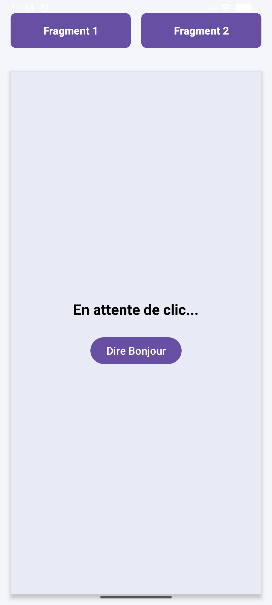
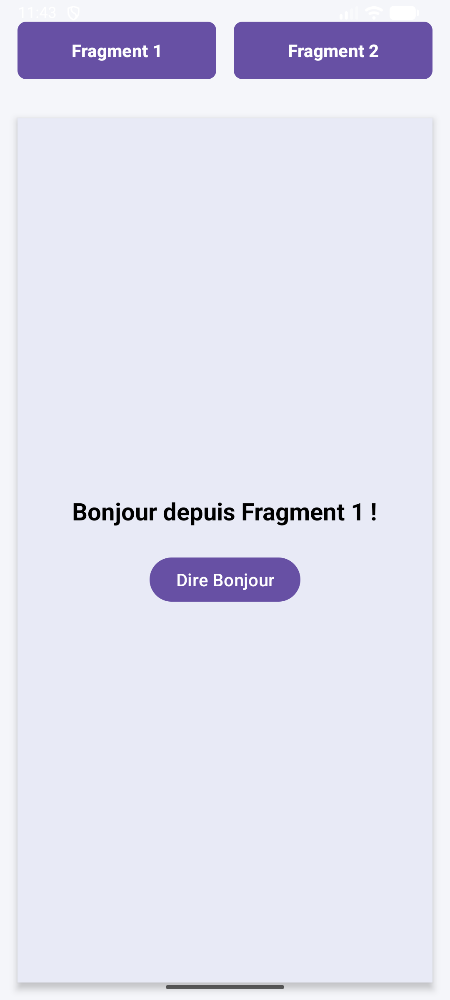
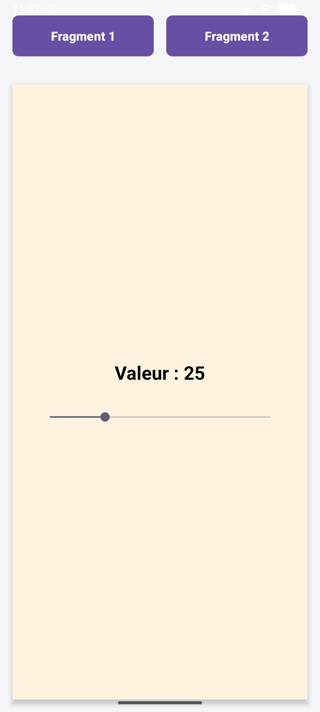

# Android Fragments Lab - Navigation Dynamique

Ce projet est une application Android pédagogique démontrant l'utilisation des **Fragments** pour créer une interface utilisateur modulaire, fluide et dynamique. L'objectif est de simuler un comportement de type "Single Page Application" (comme AJAX sur le Web) où seule une partie de l'écran est mise à jour.

## 🚀 Concepts Appris

* **Gestion des Fragments Dynamiques** : Remplacement de fragments dans un `FrameLayout` sans recharger l'Activité.
* **FragmentManager & Transactions** : Utilisation de `beginTransaction()`, `replace()` et `commit()`.
* **BackStack** : Gestion de l'historique de navigation pour permettre l'utilisation du bouton "Retour" du téléphone.
* **Cycle de Vie** : Différence entre `onCreate` (Activity) et `onViewCreated` (Fragment).
* **Persistance d'État** : Utilisation de `onSaveInstanceState` pour conserver les données (ex: position d'une SeekBar) lors d'une rotation d'écran.

## 📸 Captures d'écran (PoC)

Voici le rendu de l'application dans ses différents états :

| Layout Par Défaut | Fragment 1 | Fragment 2 |
|:---:|:---:|:---:|
|  |  |  |
| *État initial de l'activité* | *Interaction simple (Bouton)* | *Gestion d'état (SeekBar)* |

## 🛠️ Structure du Projet

L'application est composée des éléments suivants :

1.  **MainActivity** : Le conteneur principal abritant le menu de navigation (Boutons) et la zone d'affichage (`fragment_container`).
2.  **FragmentOne** : Un fragment simple illustrant la gestion des événements (`setOnClickListener`) à l'intérieur d'une vue locale.
3.  **FragmentTwo** : Un fragment plus complexe utilisant une `SeekBar`. Il démontre comment sauvegarder des variables primitives lors de la destruction/recréation du fragment (rotation).

## 💻 Installation

1.  Cloner le dépôt.
2.  Ouvrir le projet dans **Android Studio** (Giraffe ou version ultérieure).
3.  Synchroniser le projet avec les fichiers Gradle.
4.  Lancer sur un émulateur ou un appareil physique (API 21+).

## 📝 Utilisation

* Appuyez sur **"Fragment 1"** pour charger une interface de salutation.
* Appuyez sur **"Fragment 2"** pour manipuler une barre de progression.
* **Test de rotation** : Déplacez la SeekBar dans le Fragment 2, tournez votre écran, et constatez que la valeur est conservée grâce à `onSaveInstanceState`.
* **Bouton Retour** : Utilisez le bouton retour du système pour naviguer vers le fragment précédent sans fermer l'application.

---
*Projet réalisé dans le cadre de l'apprentissage du développement mobile Android.*
